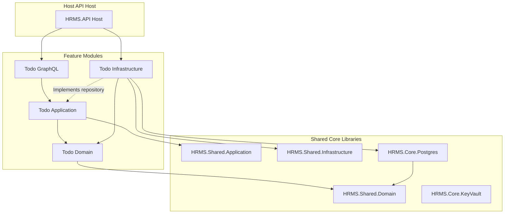
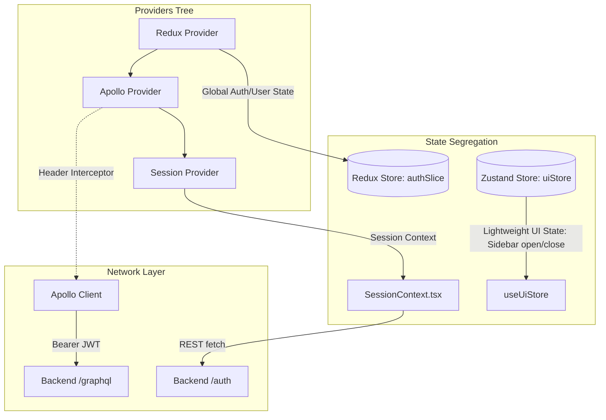
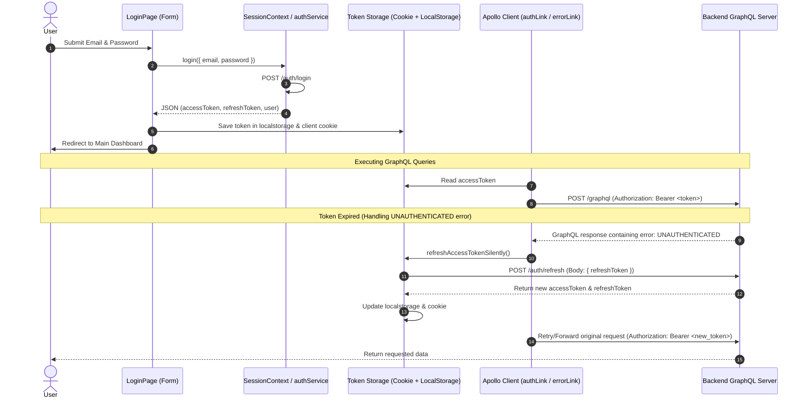
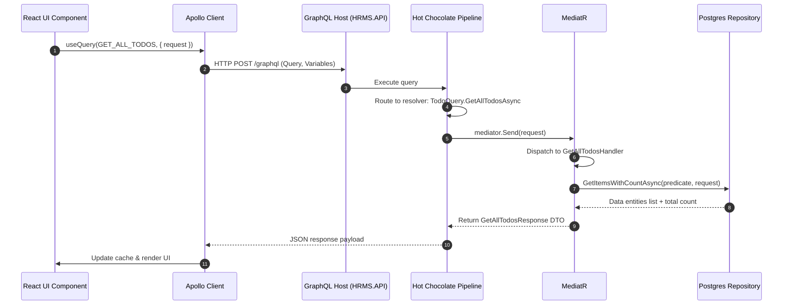

# Repository Analysis Report: Global HRMS

This report provides a detailed breakdown of the Global HRMS boilerplate repository architecture, technology stacks, folder structures, and execution flows based on code inspection.

---

## 1. Technology Stack

### Backend
*   **Target Framework**: `.NET 10.0 Core`
*   **API Protocol**: `GraphQL` (powered by **Hot Chocolate v14+**) alongside configured ASP.NET REST Controllers
*   **Database & ORM**: `PostgreSQL` using **Entity Framework Core** (`Microsoft.EntityFrameworkCore` & `Npgsql.EntityFrameworkCore.PostgreSQL`)
*   **CQRS & Messaging**: **MediatR** for decoupling execution logic from resolvers and controllers
*   **Validation, Mapping & Auditing**: **FluentValidation** for DTO validation, **AutoMapper** for entity mappings, and custom Audit Interceptors
*   **Telemetry**: **Azure Application Insights** for request, dependency, and custom database metrics tracing
*   **Secrets & Key Management**: **Azure Key Vault** (configured with Active Directory Client secrets)

### Frontend
*   **Framework**: **Next.js 16.0.3** (utilizing App Router and TypeScript)
*   **Core UI Engine**: **React 19.2.0**
*   **GraphQL Client**: **Apollo Client 4.0.9** (fully configured for queries, mutations, in-memory caching, and automatic token refresh retries)
*   **State Management**:
    *   **Redux Toolkit 2.11.0**: Manages global application and business state (e.g., authentication credentials, user profiles)
    *   **Zustand 5.0.8**: Manages lightweight local UI state (e.g., sidebar drawer open/close toggle)
    *   **React Context**: Scoped context providers (e.g., `SessionContext` for login/logout orchestration)
*   **Styling**: **Tailwind CSS v4.0** (integrated via PostCSS)
*   **Data Grids**: **@tanstack/react-table 8.21.3** for rich, server-ready pagination, filtering, and sorting
*   **Form Validation**: **Zod 4.1.13** (used for Zod schemas parsing and UI inputs validation)

---

## 2. Folder Structure

The repository splits clean frontend and backend concerns. Below is the simplified folder tree:

```text
Root/
├── Global-HRMS-Product-Specification.docx      # Product Specification Document (PSD)
├── Project_Context.md                          # Verification notes & project objectives
│
├── HRMS_Modular_Monolithic_BolierPlate Without Git/  # Backend Modular Monolith
│   └── HRMS_Modular_Monolithic_BolierPlate Without Git/
│       ├── HRMSBoilerPlate.slnx                # Visual Studio Solution File
│       ├── API/
│       │   └── HRMS.API/                       # Web API Entry Host
│       │       ├── Extensions/                 # Configuration files (CORS, GraphQL, DB DI)
│       │       ├── Middleware/                 # Exception, IP address, Local protection middlewares
│       │       ├── RegisterDependencies/       # Module dependency linking
│       │       ├── Program.cs / Startup.cs     # Host builder entry point and middleware pipeline
│       │       └── appsettings.json            # Configuration keys
│       │
│       ├── Shared/                             # Shared Clean Architecture libraries
│       │   ├── HRMS.Shared.Core/
│       │   │   ├── HRMS.Core.HttpHelper/       # Common HTTP helpers
│       │   │   ├── HRMS.Core.KeyVault/         # Azure Key Vault configuration loading
│       │   │   ├── HRMS.Core.Postgres/         # PostgresDbContext & generic PostgresDbRepository
│       │   │   └── HRMS.Core.Telemetry/        # Diagnostics & App Insights wrapper
│       │   ├── HRMS.Shared.Domain/             # Core base entities (Address, UserBase) and enums
│       │   ├── HRMS.Shared.Application/        # Global commands, base query, and auto-audit resolver hooks
│       │   └── HRMS.Shared.Infrastructure/     # MediatR and AutoMapper extensions
│       │
│       └── Modules/                            # Feature Modules (Domain/App/Infra/GraphQL isolation)
│           ├── TodoFeature/                    # Fully Implemented Reference Module
│           │   ├── TodoFeature.Domain/         # Todo Entity
│           │   ├── TodoFeature.Application/    # MediatR Handlers, Request DTOs, Mapping and Validation
│           │   ├── TodoFeature.GraphQL/        # Hot Chocolate Query and Mutation extensions
│           │   └── TodoFeature.Infrastructure/ # Table mapping and Repository implementations
│           ├── UserFeature/                    # Stub/Partial Module
│           └── ServiceRequestFeature/          # Stub/Partial Module
│
└── nextjs-boiler-plate-v16.0.3/                # Next.js Frontend Application
    ├── app/                                    # Routes and Pages (Next.js App Router)
    │   ├── (auth)/login/                       # Log In Route Page
    │   ├── examples/table/                     # Data Table Example Page (TanStack Table)
    │   ├── globals.css / layout.tsx / page.tsx # Global styles, layout, and main entry
    │   └── providers.tsx                       # Nesting Redux, Apollo and Session Providers
    ├── components/                             # UI Component folder
    │   └── table/DataTable.tsx                 # Core TanStack-based filter-ready table component
    ├── context/                                # React Contexts
    │   └── SessionContext.tsx                  # Sign-in/Sign-out controller
    ├── graphql/                                # Queries, Mutations, and Subscriptions
    │   ├── query/example.ts                    # Root schema querying
    │   └── mutation/generateOtpByEmail.ts      # OTP Email Mutation definition
    ├── lib/                                    # Network and Client configuration
    │   ├── apolloClient.ts                     # Apollo configuration & Auth Header Interceptor
    │   └── auth/
    │       ├── authService.ts                  # REST requests to backend Auth endpoints
    │       └── tokenStorage.ts                 # Access/Refresh tokens state (localStorage & Cookies)
    ├── store/                                  # Redux Toolkit Config
    │   ├── authSlice.ts                        # Active credentials reducer
    │   └── index.ts                            # Redux store creator
    └── stores/                                 # Zustand Config
        └── uiStore.ts                          # Sidebar drawer state store
```

---

## 3. Backend Architecture

The backend implements a **Modular Monolithic Architecture** adhering to **Domain-Driven Design (DDD)** guidelines.



*   **Assembly Isolation**: The project isolates modules under `Modules/`. Each module is separated into distinct sub-projects (`Domain`, `Application`, `Infrastructure`, `GraphQL`) to prevent leaky abstractions.
*   **Decoupling via MediatR**: GraphQL Resolvers/REST controllers do not interface directly with the database context or repository implementations. Instead, they send command/query objects through `IMediator.Send()`, matching requests to handlers in the `Application` assembly.
*   **Dynamic Schema Merging**: The backend utilizes Hot Chocolate's type extensions. Each module extends the root queries/mutations independently via `[ExtendObjectType(typeof(Query))]` or `[ExtendObjectType(typeof(Mutation))]`, which are loaded at initialization through `builder.AddGraphQLModules()`.
*   **Isolated Database Mappings**: Rather than compiling a global database configuration, each module defines its EF Core mappings by implementing `IPostgresEntityConfigurator`. The shared `PostgresDbContext` dynamically loads and applies these configurations in `OnModelCreating`.

---

## 4. Frontend Architecture

The frontend follows an **App-like, Mobile-First responsive framework** built on Next.js 16.



*   **State Separation**:
    *   **Redux Toolkit (`store/`)**: Retains global business data, specifically user identities and credentials (`authSlice.ts`).
    *   **Zustand (`stores/`)**: Manages lightweight component layouts (e.g., `uiStore.ts` for toggling the sidebar), ensuring swift, re-render free UI changes.
    *   **React Context (`context/`)**: Orchestrates high-level login/logout session states.
*   **Provider Tree**: Root elements are nested inside `app/providers.tsx`, creating an unified context wrapping Next.js page nodes.
*   **Standardized Component Framework**: Predefined TanStack Table wrapper (`components/table/DataTable.tsx`) drives tables UI rendering, handling sorting, paginations, and complex custom filter menus (checkboxes, date range, number range).

---

## 5. Authentication Flow

The repository executes a robust JWT-based credentials token loop with automated silent token refreshing:



*   **Guard Middleware (`middleware.ts`)**: Runs at the Next.js edge server level. It inspects the client's `auth_token` cookie for route access. If absent, the user is redirected to `/login`, preserving the original target path.
*   **Apollo Token Interceptor**: Apollo's `authLink` extracts the JWT from the token storage (`getAccessToken()`) and adds the `Authorization` header to all operations.
*   **Automatic Error Catching**: Apollo's `errorLink` intercepts errors. If a request returns an `UNAUTHENTICATED` error code, the client halts requests, runs `refreshAccessTokenSilently()`, updates the cached credentials, and transparently retries the failed operation.

---

## 6. Database Layer

*   **Database Engine**: PostgreSQL
*   **Base Entity Model (`BaseEntity.cs`)**: Standardized structure providing automated auditing logs tracking:
    *   `CreatedOn`, `CreatedByUserId`, `CreatedByUserName`
    *   `ModifiedOn`, `ModifiedByUserId`, `ModifiedByUserName`
*   **Audit Resolution Hook**: `BaseEntityAuditAction` and `UserContextValueResolver` hook into the mapper step to fetch current HTTP context claims (e.g. `ClaimsPrincipal`) and populate the auditing properties before the record is saved.
*   **DbContext Modular Isolation**: Each module is self-configuring. The base `PostgresDbContext` relies on DI discovery to fetch all entity configurations:
    ```csharp
    public class PostgresDbContext : DbContext
    {
        private readonly IEnumerable<IPostgresEntityConfigurator> _configurators;
        // ...
        protected override void OnModelCreating(ModelBuilder modelBuilder)
        {
            foreach (var configurator in _configurators)
            {
                configurator.Configure(modelBuilder);
            }
            base.OnModelCreating(modelBuilder);
        }
    }
    ```
*   **Generic Repository Pattern**: `PostgresDbRepository<T>` supplies standard CRUD operations (`AddItemAsync`, `DeleteItemAsync`, `GetItemAsync`, `GetItemsWithCountAsync`, `UpdateItemAsync`). It automatically registers database metrics and intercepts database sessions with current user claims.

---

## 7. GraphQL Flow

GraphQL handles all data exchanges on the app. Below is the operational lifecycle of a request:



1.  **Definitions**: Queries and mutations are declared in the frontend under `graphql/` using Apollo's `gql` tag helper.
2.  **Hooks Execution**: React components call queries/mutations via hooks (`useQuery` / `useMutation`), passing parameters as GraphQL variables.
3.  **Authentication Binding**: `authLink` attaches token credentials to outbound HTTP requests.
4.  **Schema Routing**: The backend Hot Chocolate engine accepts the request, validates the schema structure, and calls the mapped resolver (`TodoQuery` / `TodoMutation`).
5.  **Application Dispatching**: The resolver dispatches the request payload as a MediatR query/command.
6.  **Persistence Querying**: The matching MediatR handler queries database entities via its injected module repository (`ITodoRepository`).
7.  **Data Serialization**: Database results are mapped to DTO objects, wrapped in a standardized response wrapper (`BaseResponse<T>` / `BaseResponsePagination<T>`), serialized into JSON, and returned to the client.
